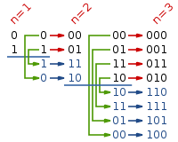

## Gray Code


### 描述

The gray code is a binary numeral system where two successive values differ in only one bit.

Given a non-negative integer `n` representing the total number of bits in the code, print the sequence of gray code. A gray code sequence must begin with 0.

For example, given `n = 2`, return `[0,1,3,2]`. Its gray code sequence is:

```
00 - 0
01 - 1
11 - 3
10 - 2
```


Note:

* For a given `n`, a gray code sequence is not uniquely defined.
* For example, `[0,2,3,1]` is also a valid gray code sequence according to the above definition.
* For now, the judge is able to judge based on one instance of gray code sequence. Sorry about that.


### 分析

格雷码(Gray Code)的定义请参考 <http://en.wikipedia.org/wiki/Gray_code>

**自然二进制码转换为格雷码**：$$g_0=b_0, g_i=b_i \oplus b_{i-1}$$

保留自然二进制码的最高位作为格雷码的最高位，格雷码次高位为二进制码的高位与次高位异或，其余各位与次高位的求法类似。例如，将自然二进制码1001，转换为格雷码的过程是：保留最高位；然后将第1位的1和第2位的0异或，得到1，作为格雷码的第2位；将第2位的0和第3位的0异或，得到0，作为格雷码的第3位；将第3位的0和第4位的1异或，得到1，作为格雷码的第4位，最终，格雷码为1101。

**格雷码转换为自然二进制码**：$$b_0=g_0, b_i=g_i \oplus b_{i-1}$$

保留格雷码的最高位作为自然二进制码的最高位，次高位为自然二进制高位与格雷码次高位异或，其余各位与次高位的求法类似。例如，将格雷码1000转换为自然二进制码的过程是：保留最高位1，作为自然二进制码的最高位；然后将自然二进制码的第1位1和格雷码的第2位0异或，得到1，作为自然二进制码的第2位；将自然二进制码的第2位1和格雷码的第3位0异或，得到1，作为自然二进制码的第3位；将自然二进制码的第3位1和格雷码的第4位0异或，得到1，作为自然二进制码的第4位，最终，自然二进制码为1111。

格雷码有**数学公式**，整数`n`的格雷码是$$n \oplus (n/2)$$。

这题要求生成`n`比特的所有格雷码。

方法1，最简单的方法，利用数学公式，对从 $$0\sim2^n-1$$的所有整数，转化为格雷码。

方法2，`n`比特的格雷码，可以递归地从`n-1`比特的格雷码生成。如图\S \ref{fig:gray-code-construction}所示。




### 数学公式


  



### Reflect-and-prefix method


  

